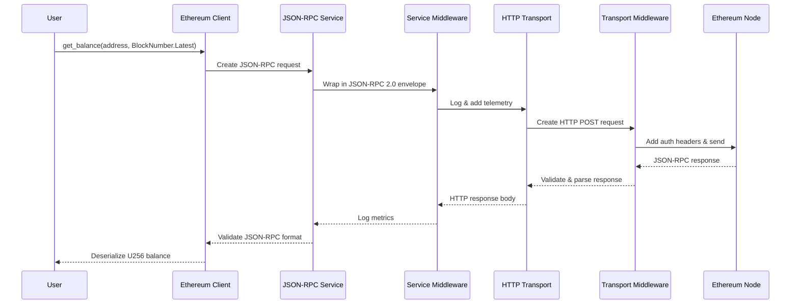
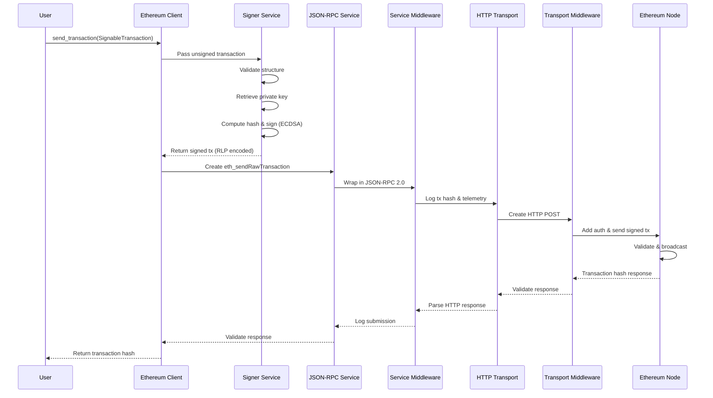

# Ethereum Client

A complete Ethereum JSON-RPC client that combines HTTP and WebSocket transports to provide a type-safe, high-performance API for blockchain interaction. Built on the same layered architecture as the transport stack, it supports batch processing, real-time subscriptions, and transaction signing across Rust, Python, and Node.js.

## Architecture Overview

The Ethereum client builds on the transport stack to provide blockchain-specific functionality with integrated transaction signing:

```
┌─────────────────────────────────────────────────────────┐
│ Ethereum Client                                         │  ← High-level blockchain API
│ (Namespaces + Batch + Signing)                          │
├─────────────────────────────────────────────────────────┤
│ JSON-RPC Service / Signer Service                       │  ← Protocol + Security
│ (read operations) / (write + sign operations)           │
├─────────────────────────────────────────────────────────┤
│ Service Level Middleware                                │  ← Logging, telemetry
├─────────────────────────────────────────────────────────┤
│ HTTP Transport / WebSocket                              │  ← Transport implementations
│ (queries, txs) / (subscriptions)                        │
├─────────────────────────────────────────────────────────┤
│ Transport Level Middleware                              │  ← Load balancing, Auth, Retry
├─────────────────────────────────────────────────────────┤
│ Transport Service                                       │  ← Core transport abstraction
└─────────────────────────────────────────────────────────┘
```

## Quick Start

Get up and running with the Ethereum client in just a few lines:

### 1.1 Rust

```rust
use sb_eth_jsonrpc_client::EthJsonrpcClient;
use sb_eth_types::block::BlockNumber;

#[tokio::main]
async fn main() -> Result<(), Box<dyn std::error::Error>> {
    // Create and connect client
    let client = EthJsonrpcClient::new("https://eth.rpc.sudoblock.io");
    client.connect().await?;

    // Fetch a block
    let block = client.eth()
        .get_block_by_number(12345.into(), true)
        .await?;
    println!("Block number: {}", block.number);

    // Check balance
    let balance = client.eth()
        .get_balance(address, BlockNumber::Latest)
        .await?;
    println!("Balance: {}", balance);

    Ok(())
}
```

### 1.2 Python

```python
import asyncio
from sb_eth_jsonrpc_client import EthJsonrpcClient, BlockNumber

async def main():
    # Create and connect client
    client = EthJsonrpcClient("https://eth.rpc.sudoblock.io")
    await client.connect()

    # Fetch a block
    block = await client.eth().get_block_by_number(12345, True)
    print(f"Block number: {block.number}")

    # Check balance
    balance = await client.eth().get_balance(address, BlockNumber.LATEST)
    print(f"Balance: {balance}")

if __name__ == "__main__":
    asyncio.run(main())
```

### 1.3 TypeScript

```typescript
import { EthJsonrpcClient, BlockNumber } from 'sb-eth-jsonrpc-client';

async function main() {
    // Create and connect client
    const client = new EthJsonrpcClient("https://eth.rpc.sudoblock.io");
    await client.connect();

    // Fetch a block
    const block = await client.eth().getBlockByNumber(12345, true);
    console.log(`Block number: ${block.number}`);

    // Check balance
    const balance = await client.eth().getBalance(address, BlockNumber.LATEST);
    console.log(`Balance: ${balance}`);
}

main().catch(console.error);
```

## Core Concepts

### Client Initialization

The Ethereum client can be initialized with default settings or custom configuration:

#### Basic Initialization

### 1.1 Rust

```rust
use sb_eth_jsonrpc_client::EthJsonrpcClient;

#[tokio::main]
async fn main() -> Result<(), Box<dyn std::error::Error>> {
    // Create client with defaults
    let client = EthJsonrpcClient::new("https://eth.rpc.sudoblock.io");
    client.connect().await?;

    // Client is now ready to use
    Ok(())
}
```

### 1.2 Python

```python
import asyncio
from sb_eth_jsonrpc_client import EthJsonrpcClient

async def main():
    # Create client with defaults
    client = EthJsonrpcClient("https://eth.rpc.sudoblock.io")
    await client.connect()

    # Client is now ready to use

if __name__ == "__main__":
    asyncio.run(main())
```

### 1.3 TypeScript

```typescript
import { EthJsonrpcClient } from 'sb-eth-jsonrpc-client';

async function main() {
    // Create client with defaults
    const client = new EthJsonrpcClient("https://eth.rpc.sudoblock.io");
    await client.connect();

    // Client is now ready to use
}

main().catch(console.error);
```

#### Custom Configuration

Configure transport settings, endpoints, and blockchain-specific options:

### 1.1 Rust

```rust
use sb_eth_jsonrpc_client::{EthJsonrpcClient, EthJsonrpcClientConfig, Endpoint};
use sb_stack_transport_http::TransportConfig;
use sb_stack_transport_ws::WsTransportConfig;
use std::time::Duration;

#[tokio::main]
async fn main() -> Result<(), Box<dyn std::error::Error>> {
    // Configure HTTP transport
    let http_config = TransportConfig {
        timeout: Duration::from_secs(30),
        max_retries: 3,
        pool_max_idle_per_host: 32,
        ..Default::default()
    };

    // Configure WebSocket transport
    let ws_config = WsTransportConfig {
        ping_interval: Duration::from_secs(30),
        pong_timeout: Duration::from_secs(10),
        auto_reconnect: true,
        ..Default::default()
    };

    // Create client configuration
    let config = EthJsonrpcClientConfig {
        endpoints: vec![
            Endpoint::new(
                "https://eth.rpc.sudoblock.io".into(),
                "path_if_any".into()
            )
        ],
        http_transport_config: Some(http_config),
        ws_transport_config: Some(ws_config),
        ..Default::default()
    };

    let client = EthJsonrpcClient::new_with_config(config)?;
    client.connect().await?;

    Ok(())
}
```

### 1.2 Python

```python
import asyncio
from sb_eth_jsonrpc_client import (
    EthJsonrpcClient,
    EthJsonrpcClientConfig,
    Endpoint,
    TransportConfig,
    WsTransportConfig
)

async def main():
    # Configure HTTP transport
    http_config = TransportConfig(
        timeout=30,
        max_retries=3,
        pool_max_idle_per_host=32
    )

    # Configure WebSocket transport
    ws_config = WsTransportConfig(
        ping_interval=30,
        pong_timeout=10,
        auto_reconnect=True
    )

    # Create client configuration
    config = EthJsonrpcClientConfig(
        endpoints=[
            Endpoint("https://eth.rpc.sudoblock.io", "path_if_any")
        ],
        http_transport_config=http_config,
        ws_transport_config=ws_config
    )

    client = EthJsonrpcClient.new_with_config(config)
    await client.connect()

if __name__ == "__main__":
    asyncio.run(main())
```

### 1.3 TypeScript

```typescript
import {
    EthJsonrpcClient,
    EthJsonrpcClientConfig,
    Endpoint,
    TransportConfig,
    WsTransportConfig
} from 'sb-eth-jsonrpc-client';

async function main() {
    // Configure HTTP transport
    const httpConfig = new TransportConfig({
        timeout: 30000,
        maxRetries: 3,
        poolMaxIdlePerHost: 32
    });

    // Configure WebSocket transport
    const wsConfig = new WsTransportConfig({
        pingInterval: 30000,
        pongTimeout: 10000,
        autoReconnect: true
    });

    // Create client configuration
    const config = new EthJsonrpcClientConfig({
        endpoints: [
            new Endpoint("https://eth.rpc.sudoblock.io", "path_if_any")
        ],
        httpTransportConfig: httpConfig,
        wsTransportConfig: wsConfig
    });

    const client = EthJsonrpcClient.newWithConfig(config);
    await client.connect();
}

main().catch(console.error);
```

### Namespace API

The client organizes JSON-RPC methods into namespaces for clean, type-safe access:

#### Eth Namespace

Access standard Ethereum RPC methods:

### 1.1 Rust

```rust
use sb_eth_jsonrpc_client::EthJsonrpcClient;
use sb_eth_types::block::BlockNumber;

#[tokio::main]
async fn main() -> Result<(), Box<dyn std::error::Error>> {
    let client = EthJsonrpcClient::new();
    client.connect().await?;

    // Get current block number
    let block_number = client.eth().block_number().await?;
    println!("Current block: {}", block_number);

    // Get account balance
    let balance = client.eth()
        .get_balance(address, BlockNumber::Latest)
        .await?;
    println!("Balance: {}", balance);

    // Get transaction count (nonce)
    let tx_count = client.eth()
        .get_transaction_count(address, BlockNumber::Latest)
        .await?;
    println!("Nonce: {}", tx_count);

    Ok(())
}
```

### 1.2 Python

```python
import asyncio
from sb_eth_jsonrpc_client import EthJsonrpcClient, BlockNumber

async def main():
    client = EthJsonrpcClient()
    await client.connect()

    # Get current block number
    block_number = await client.eth.block_number()
    print(f"Current block: {block_number}")

    # Get account balance
    balance = await client.eth.get_balance(address, BlockNumber.LATEST)
    print(f"Balance: {balance}")

    # Get transaction count (nonce)
    tx_count = await client.eth.get_transaction_count(
        address,
        BlockNumber.LATEST
    )
    print(f"Nonce: {tx_count}")

if __name__ == "__main__":
    asyncio.run(main())
```

### 1.3 TypeScript

```typescript
import { EthJsonrpcClient, BlockNumber } from 'sb-eth-jsonrpc-client';

async function main() {
    const client = new EthJsonrpcClient();
    await client.connect();

    // Get current block number
    const blockNumber = await client.eth.blockNumber();
    console.log(`Current block: ${blockNumber}`);

    // Get account balance
    const balance = await client.eth.getBalance(address, BlockNumber.LATEST);
    console.log(`Balance: ${balance}`);

    // Get transaction count (nonce)
    const txCount = await client.eth.getTransactionCount(
        address,
        BlockNumber.LATEST
    );
    console.log(`Nonce: ${txCount}`);
}

main().catch(console.error);
```

#### Other Namespaces

Access debugging, network, and utility methods through dedicated namespaces:

### 1.1 Rust

```rust
use sb_eth_jsonrpc_client::EthJsonrpcClient;

#[tokio::main]
async fn main() -> Result<(), Box<dyn std::error::Error>> {
    let client = EthJsonrpcClient::new();
    client.connect().await?;

    // Debug namespace - trace transactions
    let trace = client.debug().trace_transaction(tx_hash).await?;
    let raw_block = client.debug().get_raw_block(block_id).await?;

    // Net namespace - network info
    let network_id = client.net().version().await?;
    let peer_count = client.net().peer_count().await?;

    // Web3 namespace - utility methods
    let client_version = client.web3().client_version().await?;
    let sha3_hash = client.web3().sha3(data).await?;

    // Trace namespace - transaction tracing
    let tx_trace = client.trace().trace_transaction(tx_hash).await?;

    Ok(())
}
```

### 1.2 Python

```python
import asyncio
from sb_eth_jsonrpc_client import EthJsonrpcClient

async def main():
    client = EthJsonrpcClient()
    await client.connect()

    # Debug namespace - trace transactions
    trace = await client.debug.trace_transaction(tx_hash)
    raw_block = await client.debug.get_raw_block(block_id)

    # Net namespace - network info
    network_id = await client.net.version()
    peer_count = await client.net.peer_count()

    # Web3 namespace - utility methods
    client_version = await client.web3.client_version()
    sha3_hash = await client.web3.sha3(data)

    # Trace namespace - transaction tracing
    tx_trace = await client.trace.trace_transaction(tx_hash)

if __name__ == "__main__":
    asyncio.run(main())
```

### 1.3 TypeScript

```typescript
import { EthJsonrpcClient } from 'sb-eth-jsonrpc-client';

async function main() {
    const client = new EthJsonrpcClient();
    await client.connect();

    // Debug namespace - trace transactions
    const trace = await client.debug.traceTransaction(txHash);
    const rawBlock = await client.debug.getRawBlock(blockId);

    // Net namespace - network info
    const networkId = await client.net.version();
    const peerCount = await client.net.peerCount();

    // Web3 namespace - utility methods
    const clientVersion = await client.web3.clientVersion();
    const sha3Hash = await client.web3.sha3(data);

    // Trace namespace - transaction tracing
    const txTrace = await client.trace.traceTransaction(txHash);
}

main().catch(console.error);
```

### Batch Processing

Efficiently send multiple RPC requests in a single round trip:

### 1.1 Rust

```rust
use sb_eth_jsonrpc_client::EthJsonrpcClient;
use sb_eth_types::block::BlockNumber;

#[tokio::main]
async fn main() -> Result<(), Box<dyn std::error::Error>> {
    let client = EthJsonrpcClient::new();
    client.connect().await?;

    // Create a batch request
    let mut batch = client.create_batch()?;

    // Prepare multiple requests
    let block_req = client.eth().get_block_by_number(12345.into(), true);
    let balance_req = client.eth().get_balance(address, BlockNumber::Latest);
    let nonce_req = client.eth().get_transaction_count(address, BlockNumber::Latest);

    // Add requests to batch and get IDs for retrieving responses
    let block_id = batch.add_request(block_req.request.into_value_request()?);
    let balance_id = batch.add_request(balance_req.request.into_value_request()?);
    let nonce_id = batch.add_request(nonce_req.request.into_value_request()?);

    // Send all requests at once
    let response = batch.send().await?;

    // Extract individual responses
    let block: Block = response.get_typed_response(&block_id)?;
    let balance: U256 = response.get_typed_response(&balance_id)?;
    let nonce: U256 = response.get_typed_response(&nonce_id)?;

    println!("Block: {}", block.number);
    println!("Balance: {}", balance);
    println!("Nonce: {}", nonce);

    Ok(())
}
```

### 1.2 Python

```python
import asyncio
from sb_eth_jsonrpc_client import EthJsonrpcClient
from sb_eth_jsonrpc_client.types.block import BlockNumber, BlockEnum

async def main():
    client = EthJsonrpcClient(endpoints=["https://eth.rpc.sudoblock.io"])
    await client.connect()

    # Create a batch request
    batch = client.create_batch()

    # Prepare multiple requests
    block_req = client.eth.get_block_by_number(12345, True)
    balance_req = client.eth.get_balance(address, BlockNumber(BlockEnum.LATEST))
    nonce_req = client.eth.get_transaction_count(address, BlockNumber(BlockEnum.LATEST))

    # Add requests to batch
    batch.add_request(block_req)
    batch.add_request(balance_req)
    batch.add_request(nonce_req)

    # Send all requests at once and get response
    batch_response = await batch

    # Extract individual responses (automatically typed based on request)
    block = batch_response.get_result(0)
    balance = batch_response.get_result(1)
    nonce = batch_response.get_result(2)

    print(f"Block: {block.number}")
    print(f"Balance: {balance}")
    print(f"Nonce: {nonce}")

if __name__ == "__main__":
    asyncio.run(main())
```

### 1.3 TypeScript

```typescript
import { EthJsonrpcClient, BlockNumber ,Block } from 'sb-eth-jsonrpc-client';

async function main() {
    const client = new EthJsonrpcClient({ endpoints: ['https://eth.rpc.sudoblock.io'] });
    await client.connect();

    // Create a batch request
    const batch = client.createBatch();

    // Prepare multiple requests
    const blockReq = client.eth().getBlockByNumber(12345, true);
    const balanceReq = client.eth().getBalance(address, BlockNumber.LATEST);
    const nonceReq = client.eth().getTransactionCount(address, BlockNumber.LATEST);

    // Add requests to batch and get IDs for retrieving responses
    const blockId = batch.addRequest(blockReq.request);
    const balanceId = batch.addRequest(balanceReq.request);
    const nonceId = batch.addRequest(nonceReq.request);

    // Send all requests at once
    const response = await batch.send();

    // Extract individual responses
    const block:Block= response.getTypedResponse(blockId);
    const balance:U256 = response.getTypedResponse(balanceId);
    const nonce:U256 = response.getTypedResponse(nonceId);

    console.log(`Block: ${block.number}`);
    console.log(`Balance: ${balance}`);
    console.log(`Nonce: ${nonce}`);
}

main().catch(console.error);
```

### WebSocket Subscriptions

Subscribe to real-time blockchain events using WebSocket transport with PubSub:

#### Subscribe to New Block Headers

### 1.1 Rust

```rust
use sb_eth_jsonrpc_client::EthJsonrpcClient;
use futures::StreamExt;

#[tokio::main]
async fn main() -> Result<(), Box<dyn std::error::Error>> {
    let client = EthJsonrpcClient::new_websocket_from_url(
        "wss://eth-mainnet.example.com/v1/ws".to_string()
    )?;
    client.connect().await?;

    // Subscribe to new block headers
    let (sub_id, subscription) = client
        .eth()
        .subscribe_new_heads()
        .await?;

    println!("Subscribed with ID: {:?}", sub_id);

    // Convert subscription to stream
    let mut stream = subscription.into_stream();

    // Process incoming blocks
    while let Some(header_result) = stream.next().await {
        match header_result {
            Ok(block_header) => {
                println!("New block: {:?}", block_header.number);
            }
            Err(err) => {
                eprintln!("Error receiving block: {:?}", err);
                break;
            }
        }
    }

    Ok(())
}
```

### 1.2 Python

```python
import asyncio
from sb_eth_jsonrpc_client import EthJsonrpcClient

async def main():
    client = EthJsonrpcClient.new_websocket_from_url(
        "wss://eth-mainnet.example.com/v1/ws"
    )
    await client.connect()

    # Subscribe to new block headers
    sub_id, subscription = await client.eth.subscribe_new_heads()

    print(f"Subscribed with ID: {sub_id}")

    # Process incoming blocks
    async for block_header in subscription:
        print(f"New block: {block_header.number}")

if __name__ == "__main__":
    asyncio.run(main())
```

### 1.3 TypeScript

```typescript
import { EthJsonrpcClient } from 'sb-eth-jsonrpc-client';

async function main() {
    const client = EthJsonrpcClient.newWebsocketFromUrl(
        "wss://eth-mainnet.example.com/v1/ws"
    );
    await client.connect();

    // Subscribe to new block headers
    const { subscriptionId, subscription } = await client.eth.subscribeNewHeads();

    console.log(`Subscribed with ID: ${subscriptionId}`);

    // Process incoming blocks
    for await (const blockHeader of subscription) {
        console.log(`New block:`, blockHeader.number);
    }
}

main().catch(console.error);
```

#### Subscribe to Event Logs

### 1.1 Rust

```rust
use sb_eth_jsonrpc_client::EthJsonrpcClient;
use sb_eth_types::filters::Filter;
use futures::StreamExt;

#[tokio::main]
async fn main() -> Result<(), Box<dyn std::error::Error>> {
    let client = EthJsonrpcClient::new_websocket_from_url(
        "wss://eth-mainnet.example.com/v1/ws".to_string()
    )?;
    client.connect().await?;

    // Subscribe to logs with filter
    // For a simple example, subscribe to all logs
    // To filter by address, use: address: Some(AddressFilter::MultipleAddresses(vec![address])),
    let filter = Filter {
        from_block: None,
        to_block: None,
        address: None,
        topics: None,
        block_hash: None,
    };

    let (sub_id, subscription) = client
        .eth()
        .subscribe_logs(filter)
        .await?;

    println!("Subscribed to logs with ID: {:?}", sub_id);

    // Convert subscription to stream
    let mut stream = subscription.into_stream();

    // Process incoming logs
    while let Some(log_result) = stream.next().await {
        match log_result {
            Ok(log) => {
                println!("New log from address: {:?}", log.address);
            }
            Err(err) => {
                eprintln!("Error receiving log: {:?}", err);
                break;
            }
        }
    }

    Ok(())
}
```

### 1.2 Python

```python
import asyncio
from sb_eth_jsonrpc_client import EthJsonrpcClient
from sb_eth_jsonrpc_client.types.transaction import Filter

async def main():
    client = EthJsonrpcClient.new_websocket_from_url(
        "wss://eth-mainnet.example.com/v1/ws"
    )
    await client.connect()

    # Subscribe to logs with filter
    # For a simple example, subscribe to all logs
    log_filter = Filter(
        from_block=None,
        to_block=None,
        address=None,
        topics=None,
        block_hash=None
    )

    sub_id, subscription = await client.eth.subscribe_logs(log_filter)

    print(f"Subscribed to logs with ID: {sub_id}")

    # Process incoming logs
    async for log in subscription:
        print(f"New log from address: {log.address}")

if __name__ == "__main__":
    asyncio.run(main())
```

### 1.3 TypeScript

```typescript
import { EthJsonrpcClient } from 'sb-eth-jsonrpc-client';

async function main() {
    const client = EthJsonrpcClient.newWebsocketFromUrl(
        "wss://eth-mainnet.example.com/v1/ws"
    );
    await client.connect();

    // Subscribe to logs with filter
    // For a simple example, subscribe to all logs
    const { subscriptionId, subscription } = await client.eth.subscribeLogs({});

    console.log(`Subscribed to logs with ID: ${subscriptionId}`);

    // Process incoming logs
    for await (const log of subscription) {
        console.log(`New log from address:`, log.address);
    }
}

main().catch(console.error);
```

#### Multiple Concurrent Subscriptions

### 1.1 Rust

```rust
use sb_eth_jsonrpc_client::EthJsonrpcClient;
use sb_eth_types::filters::Filter;
use futures::StreamExt;
use tokio::select;

#[tokio::main]
async fn main() -> Result<(), Box<dyn std::error::Error>> {
    let client = EthJsonrpcClient::new_websocket_from_url(
        "wss://eth-mainnet.example.com/v1/ws".to_string()
    )?;
    client.connect().await?;

    // Subscribe to new block headers
    let (heads_id, heads_subscription) = client
        .eth()
        .subscribe_new_heads()
        .await?;
    let mut heads_stream = heads_subscription.into_stream();

    // Subscribe to logs
    let filter = Filter {
        from_block: None,
        to_block: None,
        address: None,
        topics: None,
        block_hash: None,
    };
    let (logs_id, logs_subscription) = client
        .eth()
        .subscribe_logs(filter)
        .await?;
    let mut logs_stream = logs_subscription.into_stream();

    // Subscribe to pending transactions
    let (pending_id, pending_subscription) = client
        .eth()
        .subscribe_pending_transactions()
        .await?;
    let mut pending_stream = pending_subscription.into_stream();

    println!("All subscriptions active");

    // Process all subscriptions concurrently
    loop {
        select! {
            Some(head_result) = heads_stream.next() => {
                match head_result {
                    Ok(head) => println!("New block: {:?}", head.number),
                    Err(err) => eprintln!("Error receiving head: {:?}", err),
                }
            }
            Some(log_result) = logs_stream.next() => {
                match log_result {
                    Ok(log) => println!("New log: {:?}", log.address),
                    Err(err) => eprintln!("Error receiving log: {:?}", err),
                }
            }
            Some(tx_result) = pending_stream.next() => {
                match tx_result {
                    Ok(tx_hash) => println!("Pending tx: {:?}", tx_hash),
                    Err(err) => eprintln!("Error receiving pending tx: {:?}", err),
                }
            }
        }
    }
}
```

### 1.2 Python

```python
import asyncio
from sb_eth_jsonrpc_client import EthJsonrpcClient
from sb_eth_jsonrpc_client.types.transaction import Filter

async def main():
    client = EthJsonrpcClient.new_websocket_from_url(
        "wss://eth-mainnet.example.com/v1/ws"
    )
    await client.connect()

    # Subscribe to new block headers
    heads_id, heads_sub = await client.eth.subscribe_new_heads()

    # Subscribe to logs
    log_filter = Filter(
        from_block=None,
        to_block=None,
        address=None,
        topics=None,
        block_hash=None
    )
    logs_id, logs_sub = await client.eth.subscribe_logs(log_filter)

    # Subscribe to pending transactions
    pending_id, pending_sub = await client.eth.subscribe_pending_transactions()

    print("All subscriptions active")

    # Process all subscriptions concurrently
    async def process_heads():
        async for head in heads_sub:
            print(f"New block: {head.number}")

    async def process_logs():
        async for log in logs_sub:
            print(f"New log: {log.address}")

    async def process_pending():
        async for tx_hash in pending_sub:
            print(f"Pending tx: {tx_hash}")

    # Run all processors concurrently
    await asyncio.gather(
        process_heads(),
        process_logs(),
        process_pending()
    )

if __name__ == "__main__":
    asyncio.run(main())
```

### 1.3 TypeScript

```typescript
import { EthJsonrpcClient } from 'sb-eth-jsonrpc-client';

async function main() {
    const client = EthJsonrpcClient.newWebsocketFromUrl(
        "wss://eth-mainnet.example.com/v1/ws"
    );
    await client.connect();

    // Subscribe to new block headers
    const { subscriptionId: headsId, subscription: headsSub } =
        await client.eth.subscribeNewHeads();

    // Subscribe to logs
    const { subscriptionId: logsId, subscription: logsSub } =
        await client.eth.subscribeLogs({});

    // Subscribe to pending transactions
    const { subscriptionId: pendingId, subscription: pendingSub } =
        await client.eth.subscribePendingTransactions();

    console.log("All subscriptions active");

    // Process all subscriptions concurrently
    await Promise.all([
        (async () => {
            for await (const head of headsSub) {
                console.log(`New block:`, head.number);
            }
        })(),
        (async () => {
            for await (const log of logsSub) {
                console.log(`New log:`, log.address);
            }
        })(),
        (async () => {
            for await (const txHash of pendingSub) {
                console.log(`Pending tx:`, txHash);
            }
        })()
    ]);
}

main().catch(console.error);
```

### Signer Service

The Ethereum client integrates a pluggable signer service for transaction signing. The signer is a separate, modular component that can be swapped based on your security requirements.

#### Signer Architecture

```
┌─────────────────────────────────────┐
│     Ethereum Client                 │
│  (calls send_transaction)           │
└─────────────┬───────────────────────┘
              │
              ↓
┌─────────────────────────────────────┐
│        Signer Service               │  ← Pluggable component
│  (signs transaction with private key)│
└─────────────────────────────────────┘
              │
              ├─→ Local Signer (private key in memory)
              ├─→ Hardware Wallet (Ledger, Trezor)
              ├─→ KMS Signer (AWS KMS, Google Cloud KMS)
              └─→ Remote Signer (separate service)
```

#### Signer Types

The signer service supports multiple implementations:

1. **Local Signer** - Private key in memory (for development/testing)
2. **Hardware Wallet Signer** - Ledger, Trezor (for production)
3. **KMS Signer** - AWS KMS, Google Cloud KMS (for cloud deployments)
4. **Remote Signer** - Separate signing service (for enterprise)

#### Creating Signers

### 1.1 Rust

```rust
use sb_eth_signer_local::EthPrivateKeySigner;
use sb_eth_signer::EthSignerT;

#[tokio::main]
async fn main() -> Result<(), Box<dyn std::error::Error>> {
    // Option 1: From private key hex string
    let signer = EthPrivateKeySigner::from_hex("0x...")?;

    // Option 2: From private key bytes
    let private_key_bytes: [u8; 32] = [...];
    let signer = EthPrivateKeySigner::from_bytes(private_key_bytes)?;

    // Option 3: Generate random (for testing)
    let signer = EthPrivateKeySigner::random()?;

    // Convert to trait object for use with client
    let signer_trait: Box<dyn EthSignerT> = signer.to_signer();

    // Get address from signer
    let address = signer.address();
    println!("Signer address: {}", address);

    Ok(())
}
```

### 1.2 Python

```python
import asyncio
from sb_eth_signer_local import EthPrivateKeySigner

async def main():
    # Option 1: From private key hex string
    signer = EthPrivateKeySigner.from_hex("0x...")

    # Option 2: From private key bytes
    private_key_bytes = bytes([...])
    signer = EthPrivateKeySigner.from_bytes(private_key_bytes)

    # Option 3: Generate random (for testing)
    signer = EthPrivateKeySigner.random()

    # Get address from signer
    address = signer.address()
    print(f"Signer address: {address}")

if __name__ == "__main__":
    asyncio.run(main())
```

### 1.3 TypeScript

```typescript
import { EthPrivateKeySigner } from 'sb-eth-signer-local';

async function main() {
    // Option 1: From private key hex string
    const signer = EthPrivateKeySigner.fromHex("0x...");

    // Option 2: From private key bytes
    const privateKeyBytes = new Uint8Array([...]);
    const signer2 = EthPrivateKeySigner.fromBytes(privateKeyBytes);

    // Option 3: Generate random (for testing)
    const signer3 = EthPrivateKeySigner.random();

    // Get address from signer
    const address = signer.address();
    console.log(`Signer address: ${address}`);
}

main().catch(console.error);
```

#### Integrating Signer with Client

The signer integrates seamlessly with the Ethereum client:

### 1.1 Rust

```rust
use sb_eth_jsonrpc_client::{EthJsonrpcClient, EthJsonrpcClientConfig};
use sb_eth_signer_local::EthPrivateKeySigner;

#[tokio::main]
async fn main() -> Result<(), Box<dyn std::error::Error>> {
    // Create signer
    let signer = EthPrivateKeySigner::from_hex("0x...")?.to_signer();

    // Configure client with signer
    let mut config = EthJsonrpcClientConfig::default();
    config.signer = Some(signer);

    let client = EthJsonrpcClient::new_with_config(config)?;
    client.connect().await?;

    // Now all send_transaction calls will use the signer automatically
    Ok(())
}
```

### 1.2 Python

```python
import asyncio
from sb_eth_jsonrpc_client import EthJsonrpcClient, EthJsonrpcClientConfig , EthPrivateKeySigner

async def main():
    # Create signer
    signer = EthPrivateKeySigner.from_hex("0x...")

    # Configure client with signer
    config = EthJsonrpcClientConfig()
    config.signer = signer

    client = EthJsonrpcClient.new_with_config(config)
    await client.connect()

    # Now all send_transaction calls will use the signer automatically

if __name__ == "__main__":
    asyncio.run(main())
```

### 1.3 TypeScript

```typescript
import { EthJsonrpcClient, EthJsonrpcClientConfig ,EthPrivateKeySigner} from 'sb-eth-jsonrpc-client';

async function main() {
    // Create signer
    const signer = EthPrivateKeySigner.fromHex("0x...");

    // Configure client with signer
    const config = new EthJsonrpcClientConfig();
    config.signer = signer;

    const client = EthJsonrpcClient.newWithConfig(config);
    await client.connect();

    // Now all send_transaction calls will use the signer automatically
}

main().catch(console.error);
```

#### Signer Service Benefits

1. **Pluggable Architecture**: Swap signer implementations without changing client code
2. **Security Isolation**: Signing logic is separate from networking logic
3. **Multiple Implementations**: Local, hardware wallet, KMS, remote signers
4. **Type Safety**: Compile-time guarantees for transaction signing
5. **Async Support**: Non-blocking signing operations
6. **Multi-Language**: Same interface across Rust, Python, and TypeScript

### 6. Transaction Signing

Sign and send transactions using the integrated signer service:

### 1.1 Rust

```rust
use sb_eth_jsonrpc_client::{EthJsonrpcClient, EthJsonrpcClientConfig};
use sb_eth_signer_local::EthPrivateKeySigner;
use sb_eth_types::transactions::{EthTxEip1559, SignableTransaction};
use alloy_primitives::{U256, Bytes};

#[tokio::main]
async fn main() -> Result<(), Box<dyn std::error::Error>> {
    // Create signer from private key
    let signer = EthPrivateKeySigner::from_hex("0x...")?.to_signer();

    // Create client with signer
    let mut config = EthJsonrpcClientConfig::default();
    config.signer = Some(signer);

    let client = EthJsonrpcClient::new_with_config(config)?;
    client.connect().await?;

    // Create EIP-1559 transaction
    let tx = EthTxEip1559 {
        chain_id: 1,
        nonce: 0,
        max_priority_fee_per_gas: U256::from(2_000_000_000u64),
        max_fee_per_gas: U256::from(100_000_000_000u64),
        gas_limit: 21000,
        to: address,
        value: U256::from(1_000_000_000_000_000_000u64), // 1 ETH
        data: Bytes::new(),
        access_list: vec![],
    };

    // Sign and send transaction
    let tx_hash = client.eth()
        .send_transaction(SignableTransaction::Eip1559(tx))
        .await?;

    println!("Transaction sent: {}", tx_hash);

    // Wait for receipt
    let receipt = client.eth()
        .get_transaction_receipt(tx_hash)
        .await?;

    println!("Transaction mined in block: {}", receipt.block_number);

    Ok(())
}
```

### 1.2 Python

```python
import asyncio
from sb_eth_jsonrpc_client import (
    EthJsonrpcClient,
    EthJsonrpcClientConfig,
    EthTxEip1559,
    SignableTransaction , EthPrivateKeySigner
)

async def main():
    # Create signer from private key
    signer = EthPrivateKeySigner.from_hex("0x...")

    # Create client with signer
    config = EthJsonrpcClientConfig()
    config.signer = signer

    client = EthJsonrpcClient.new_with_config(config)
    await client.connect()

    # Create EIP-1559 transaction
    tx = EthTxEip1559(
        chain_id=1,
        nonce=0,
        max_priority_fee_per_gas=2_000_000_000,
        max_fee_per_gas=100_000_000_000,
        gas_limit=21000,
        to=address,
        value=1_000_000_000_000_000_000,  # 1 ETH
        data=b'',
        access_list=[]
    )

    # Sign and send transaction
    tx_hash = await client.eth().send_transaction(
        SignableTransaction.Eip1559(tx)
    )

    print(f"Transaction sent: {tx_hash}")

    # Wait for receipt
    receipt = await client.eth().get_transaction_receipt(tx_hash)

    print(f"Transaction mined in block: {receipt.block_number}")

if __name__ == "__main__":
    asyncio.run(main())
```

### 1.3 TypeScript

```typescript
import {
    EthJsonrpcClient,
    EthJsonrpcClientConfig,
    EthTxEip1559,
    SignableTransaction , EthPrivateKeySigner
} from 'sb-eth-jsonrpc-client';

async function main() {
    // Create signer from private key
    const signer = EthPrivateKeySigner.fromHex("0x...").toSigner();

    // Create client with signer
    const config = new EthJsonrpcClientConfig();
    config.signer = signer;

    const client = EthJsonrpcClient.newWithConfig(config);
    await client.connect();

    // Create EIP-1559 transaction
    const tx = new EthTxEip1559({
        chainId: 1,
        nonce: 0,
        maxPriorityFeePerGas: 2_000_000_000n,
        maxFeePerGas: 100_000_000_000n,
        gasLimit: 21000,
        to: address,
        value: 1_000_000_000_000_000_000n, // 1 ETH
        data: new Uint8Array(),
        accessList: []
    });

    // Sign and send transaction
    const txHash = await client.eth().sendTransaction(
        SignableTransaction.Eip1559(tx)
    );

    console.log(`Transaction sent: ${txHash}`);

    // Wait for receipt
    const receipt = await client.eth().getTransactionReceipt(txHash);

    console.log(`Transaction mined in block: ${receipt.blockNumber}`);
}

main().catch(console.error);
```

## Advanced Features

### Middleware Integration

Layer middleware at multiple levels for comprehensive request/response processing:

### 1.1 Rust

```rust
use sb_eth_jsonrpc_client::{EthJsonrpcClient, EthJsonrpcClientConfig, Endpoint};
use sb_stack_transport_http::{TransportConfig};
use sb_stack_transport_ws::{WsTransportConfig};
use sb_stack_logging_middleware::{JsonRpcLoggingMiddleware,LoggingMiddleware,WsLoggingMiddleware};
use std::time::Duration;

#[tokio::main]
async fn main() -> Result<(), Box<dyn std::error::Error>> {
    // JSON-RPC Middleware
    let jsonrpc_middleware = JsonRpcLoggingMiddleware::new()
        .with_request_logging(true)
        .with_response_logging(true)
        .with_error_logging(true);

    // HTTP Transport Middleware
    let http_middleware = LoggingMiddleware::new()
        .with_request_logging(true)
        .with_response_logging(true)
        .with_timing_logging(true);

    // WebSocket Transport Middleware
    let ws_middleware = WsLoggingMiddleware::new()
        .with_frame_logging(true)
        .with_connection_logging(true)
        .with_subscription_logging(true);

    // HTTP Transport with middleware
    let http_config = TransportConfig {
        timeout: Duration::from_secs(30),
        max_retries: 3,
        pool_max_idle_per_host: 32,
        ..Default::default()
    };

    // WebSocket Transport with middleware
    let ws_config = WsTransportConfig {
        ping_interval: Duration::from_secs(30),
        pong_timeout: Duration::from_secs(10),
        auto_reconnect: true,
        ..Default::default()
    };

    // Ethereum Client with all middleware layers
    let config = EthJsonrpcClientConfig {
        endpoints: vec![
            Endpoint::new(
                "https://eth.rpc.sudoblock.io".into(),
                "path_if_any".into()
            ),
        ],
        http_transport_config: Some(http_config),
        http_transport_middlewares: vec![Box::new(http_middleware)],
        ws_transport_config: Some(ws_config),
        ws_transport_middlewares: vec![Box::new(ws_middleware)],
        middlewares: vec![Box::new(jsonrpc_middleware)],
        ..Default::default()
    };

    let client = EthJsonrpcClient::new_with_config(config)?;
    client.connect().await?;

    Ok(())
}
```

### 1.2 Python

```python
import asyncio
from sb_eth_jsonrpc_client import (
    EthJsonrpcClient,
    EthJsonrpcClientConfig,
    Endpoint,TransportConfig,
    LoggingMiddleware,
    WsTransportConfig,
    WsLoggingMiddleware,
    JsonRpcLoggingMiddleware
)

async def main():
    # JSON-RPC Middleware
    jsonrpc_middleware = JsonRpcLoggingMiddleware()
    jsonrpc_middleware.enable_request_logging(True)
    jsonrpc_middleware.enable_response_logging(True)
    jsonrpc_middleware.enable_error_logging(True)

    # HTTP Transport Middleware
    http_middleware = LoggingMiddleware()
    http_middleware.enable_request_logging(True)
    http_middleware.enable_response_logging(True)
    http_middleware.enable_timing_logging(True)

    # WebSocket Transport Middleware
    ws_middleware = WsLoggingMiddleware()
    ws_middleware.enable_frame_logging(True)
    ws_middleware.enable_connection_logging(True)
    ws_middleware.enable_subscription_logging(True)

    # HTTP Transport with middleware
    http_config = TransportConfig(
        timeout=30,
        max_retries=3,
        pool_max_idle_per_host=32,
    )

    # WebSocket Transport with middleware
    ws_config = WsTransportConfig(
        ping_interval=30,
        pong_timeout=10,
        auto_reconnect=True,
    )

    # Ethereum Client with all middleware layers
    config = EthJsonrpcClientConfig(
        endpoints=[
            Endpoint("https://eth.rpc.sudoblock.io", "")
        ],
        http_transport_config=http_config,
        http_transport_middlewares=[http_middleware],
        ws_transport_config=ws_config,
        ws_transport_middlewares=[ws_middleware],
        jsonrpc_middlewares=[jsonrpc_middleware]
    )

    client = EthJsonrpcClient.new_with_config(config)
    await client.connect()

if __name__ == "__main__":
    asyncio.run(main())
```

### 1.3 TypeScript

```typescript
import {
    EthJsonrpcClient,
    EthJsonrpcClientConfig,
    Endpoint,
    TransportConfig,
    WsTransportConfig,
    LoggingMiddleware,
    WsLoggingMiddleware,
    JsonRpcLoggingMiddleware
} from 'sb-eth-jsonrpc-client';

async function main() {
    // JSON-RPC Middleware
    const jsonrpcMiddleware = new JsonRpcLoggingMiddleware()
        .enableRequestLogging(true)
        .enableResponseLogging(true)
        .enableErrorLogging(true);

    // HTTP Transport Middleware
    const httpMiddleware = new LoggingMiddleware()
        .enableRequestLogging(true)
        .enableResponseLogging(true)
        .enableTimingLogging(true);

    // WebSocket Transport Middleware
    const wsMiddleware = new WsLoggingMiddleware()
        .enableFrameLogging(true)
        .enableConnectionLogging(true)
        .enableSubscriptionLogging(true);

    // HTTP Transport with middleware
    const httpConfig = new TransportConfig({
        timeout: 30000,
        maxRetries: 3,
        poolMaxIdlePerHost: 32,
    });

    // WebSocket Transport with middleware
    const wsConfig = new WsTransportConfig({
        pingInterval: 30000,
        pongTimeout: 10000,
        autoReconnect: true,
    });

    // Ethereum Client with all middleware layers
    const config = new EthJsonrpcClientConfig({
        endpoints: [
            new Endpoint("https://eth.rpc.sudoblock.io", "")
        ],
        httpTransportConfig=http_config,
        transportMiddlewares=[http_middleware],
        wsTransportConfig=ws_config,
        wsTransportMiddleware=[ws_middleware],
        jsonrpcMiddlewares=[jsonrpc_middleware]
    });

    const client = EthJsonrpcClient.newWithConfig(config);
    await client.connect();
}

main().catch(console.error);
```

# Error Handler Integration

The Ethereum client supports custom error handlers for sophisticated error processing, logging, and recovery strategies. Error handlers can intercept and process JSON-RPC errors at the client level before they're returned to the application.

## Error Handler Architecture

```
┌─────────────────────────────────────┐
│     Ethereum Client                 │
│  (calls RPC methods)                │
└─────────────┬───────────────────────┘
              │
              ↓ (on error)
┌─────────────────────────────────────┐
│        Error Handler                │  ← Custom error processing
│  - Log errors                       │
│  - Transform errors                 │
│  - Track metrics                    │
│  - Alert on critical errors         │
└─────────────────────────────────────┘
```

## Error Handler Capabilities

Error handlers can:
1. **Log Errors**: Record JSON-RPC errors for debugging and monitoring
2. **Track Metrics**: Count error rates by error code or method
3. **Alert on Critical Errors**: Send notifications for specific error types
4. **Custom Processing**: Implement any custom logic for error handling

## Example: Creating Error Handlers

### 1.1 Rust

```rust
use sb_eth_jsonrpc_client::{EthJsonrpcClient, EthJsonrpcClientConfig, Endpoint};
use sb_stack_jsonrpc::error::JsonRpcError;
use sb_stack_types::ServiceResult;
use std::sync::Arc;
use std::sync::atomic::{AtomicU32, Ordering};

#[derive(Debug, Clone)]
struct CustomErrorHandler {
    error_count: Arc<AtomicU32>,
    log_errors: bool,
}

impl sb_stack_jsonrpc::service::JsonRpcErrorHandler for CustomErrorHandler {
    fn handle_error(&self, error: &JsonRpcError) -> ServiceResult<()> {
        self.error_count.fetch_add(1, Ordering::SeqCst);

        if self.log_errors {
            eprintln!(
                "JSON-RPC Error: code={}, message={}",
                error.code, error.message
            );

            if let Some(data) = &error.data {
                eprintln!("Error data: {:?}", data);
            }
        }

        match error.code {
            -32000 => {
                eprintln!(" Node error detected: {}", error.message);
            }
            -32601 => {
                eprintln!(" Method not found: {}", error.message);
            }
            -32603 => {
                eprintln!("Internal error: {}", error.message);
                // Could send alert here
            }
            _ => {}
        }

        Ok(())
    }

    fn clone_box(&self) -> Box<dyn sb_stack_jsonrpc::service::JsonRpcErrorHandler> {
        Box::new(self.clone())
    }
}

#[tokio::main]
async fn main() -> Result<(), Box<dyn std::error::Error>> {
    let error_handler = CustomErrorHandler {
        error_count: Arc::new(AtomicU32::new(0)),
        log_errors: true,
    };

    let config = EthJsonrpcClientConfig {
        endpoints: vec![
            Endpoint::new(
                "https://eth.rpc.sudoblock.io".into(),
                "path_if_any".into()
            )
        ],
        error_handler: Some(Box::new(error_handler.clone())),
        ..Default::default()
    };

    let client = EthJsonrpcClient::new_with_config(config)?;
    client.connect().await?;

    match client.eth().block_number().await {
        Ok(block) => println!("Current block: {}", block),
        Err(e) => {
            eprintln!("Error: {}", e);
            println!("Total errors handled: {}", error_handler.error_count.load(Ordering::SeqCst));
        }
    }

    Ok(())
}
```

### 1.2 Python

```python
import asyncio
from sb_eth_jsonrpc_client import (
    EthJsonrpcClient,
    EthJsonrpcClientConfig,
    Endpoint,
    create_custom_error_handler
)

error_count = 0
captured_errors = []

def error_callback(error: Exception | None, jsonrpc_error: dict | None):
    global error_count, captured_errors

    error_count += 1

    if jsonrpc_error:
        captured_errors.append(jsonrpc_error)

        print(f"JSON-RPC Error: code={jsonrpc_error.get('code')}, "
              f"message={jsonrpc_error.get('message')}")

        if 'data' in jsonrpc_error:
            print(f"Error data: {jsonrpc_error['data']}")

        code = jsonrpc_error.get('code')
        message = jsonrpc_error.get('message', '')

        if code == -32000:
            print(f" Node error detected: {message}")
        elif code == -32601:
            print(f"Method not found: {message}")
        elif code == -32603:
            print(f"Internal error: {message}")

async def main():
    error_handler = create_custom_error_handler(error_callback)

    config = EthJsonrpcClientConfig(
        endpoints=[
            Endpoint("https://eth.rpc.sudoblock.io", "path_if_any")
        ],
        error_handler=error_handler
    )

    client = EthJsonrpcClient.new_with_config(config)
    await client.connect()

    try:
        block = await client.eth().block_number()
        print(f"Current block: {block}")
    except Exception as e:
        print(f"Error: {e}")
        print(f"Total errors handled: {error_count}")
        print(f"Captured errors: {captured_errors}")

if __name__ == "__main__":
    asyncio.run(main())
```

### 1.3 TypeScript

```typescript
import {
    EthJsonrpcClient,
    EthJsonrpcClientConfig,
    Endpoint,
    createCustomErrorHandler
} from 'sb-eth-jsonrpc-client';

let errorCount = 0;
const capturedErrors: any[] = [];

async function main() {
    const errorHandler = createCustomErrorHandler(
        (error: Error | null, jsonRpcError: any) => {
            errorCount++;

            if (jsonRpcError) {
                capturedErrors.push(jsonRpcError);

                console.error(
                    `JSON-RPC Error: code=${jsonRpcError.code}, ` +
                    `message=${jsonRpcError.message}`
                );

                if (jsonRpcError.data) {
                    console.error(`Error data:`, jsonRpcError.data);
                }

                switch (jsonRpcError.code) {
                    case -32000:
                        console.warn(` Node error detected: ${jsonRpcError.message}`);
                        break;
                    case -32601:
                        console.warn(` Method not found: ${jsonRpcError.message}`);
                        break;
                    case -32603:
                        console.error(`Internal error: ${jsonRpcError.message}`);
                        break;
                }
            }
        }
    );

    const config = EthJsonrpcClientConfig.default();
    config.endpoints = [
        new Endpoint("https://eth.rpc.sudoblock.io", "path_if_any")
    ];
    config.errorHandler = errorHandler;

    const client = EthJsonrpcClient.newWithConfig(config);
    await client.connect();

    try {
        const block = await client.eth().blockNumber();
        console.log(`Current block: ${block}`);
    } catch (e) {
        console.error(`Error: ${e}`);
        console.log(`Total errors handled: ${errorCount}`);
        console.log(`Captured errors:`, capturedErrors);
    }
}

main().catch(console.error);
```

### Full Configuration Example

A complete configuration with all available options:

### 1.1 Rust

```rust
use sb_eth_jsonrpc_client::{
    EthJsonrpcClientConfig,
    EthChainConfig,
    GasConfig,
    Endpoint
};
use sb_eth_types::block::BlockNumber;
use std::time::Duration;

#[tokio::main]
async fn main() -> Result<(), Box<dyn std::error::Error>> {
    let config = EthJsonrpcClientConfig {
        // RPC endpoints
        endpoints: vec![
            Endpoint::new(
                "https://eth.rpc.sudoblock.io".into(),
                "path_if_any".into()
            ),
            Endpoint::new(
                "https://eth-rpc-backup-url-goes-here.com/".into(),
                "path_if_any".into()
            ),
        ],

        // Batch processing settings
        max_batch_size: 100,
        max_wait_time: Duration::from_secs(5),
        max_pending_instructions: 1000,

        // Chain-specific configuration
        chain_config: EthChainConfig {
            chain_id: "1".to_string(),
            name: "mainnet".to_string(),
            default_block_param: BlockNumber::Latest,
            gas_config: GasConfig {
                gas_price_multiplier: 1.2,
                max_priority_fee_multiplier: 1.1,
                gas_limit_multiplier: 1.2,
            },
            client_detection: true,
        },

        // Transport configurations
        http_transport_config: Some(TransportConfig {
            timeout: Duration::from_secs(30),
            max_retries: 3,
            pool_max_idle_per_host: 32,
            ..Default::default()
        }),
        ws_transport_config: Some(WsTransportConfig {
            ping_interval: Duration::from_secs(30),
            pong_timeout: Duration::from_secs(10),
            auto_reconnect: true,
            ..Default::default()
        }),

        ..Default::default()
    };

    let client = EthJsonrpcClient::new_with_config(config)?;
    client.connect().await?;

    Ok(())
}
```

## Architecture Deep Dive

### How It All Connects

The Ethereum client demonstrates the power of the layered transport architecture with integrated signing:

```
┌─────────────────────────────────────────────────────────┐
│              Ethereum Client                            │  ← Type-safe blockchain API
│        (eth, debug, net, web3, trace)                   │
└─────────────┬──────────────────────────┬────────────────┘
              │                          │
              │ (read operations)        │ (write operations)
              ↓                          ↓
┌─────────────────────────┐  ┌─────────────────────────┐
│   JSON-RPC Service      │  │    Signer Service       │  ← Signing layer
│   (get_balance, etc)    │  │  (sign transactions)    │     - Private keys
│   + Batch Service       │  │  - Local / HW / KMS     │     - Signing logic
│   + PubSub Service      │  └─────────────────────────┘
└────────────┬────────────┘
             │
             ↓
┌─────────────────────────────────────────────────────────┐
│           Service Level Middleware                      │  ← Cross-cutting
│     (Logging, telemetry, custom logic)                  │
└────────────┬────────────────────────────────────────────┘
             │
     ┌───────┴────────┐
     ↓                ↓
┌──────────────┐  ┌──────────────┐
│ HTTP         │  │ WebSocket    │  ← Transport implementations
│ Transport    │  │ Transport    │     - Connection pooling
│ (queries)    │  │ (subscribe)  │     - Auto-reconnect
└──────┬───────┘  └──────┬───────┘
       │                 │
       └────────┬────────┘
                ↓
┌─────────────────────────────────────────────────────────┐
│         Transport Level Middleware                      │  ← Low-level concerns
│   (Auth, retry logic, rate limiting,telemetry)                    │
└────────────┬────────────────────────────────────────────┘
             │
             ↓
┌─────────────────────────────────────────────────────────┐
│            Transport Service                            │  ← Core abstraction
│      (Protocol-agnostic interface)                      │
└─────────────────────────────────────────────────────────┘
```

### Component Responsibilities

1. **Ethereum Client Layer**
   - Provides namespace-based API (eth, debug, net, etc.)
   - Coordinates transaction signing via Signer Service
   - Manages batch request coordination
   - Type-safe interfaces across all languages
   - Routes read operations to JSON-RPC, write operations to Signer

2. **Signer Service**
   - **Pluggable Architecture**: Swap implementations without changing code
   - **Transaction Signing**: Signs transactions with private keys
   - **Address Management**: Derives addresses from keys
   - **Security Isolation**: Keeps signing logic separate from networking
   - **Multiple Implementations**:
     - Local Signer: Private key in memory
     - Hardware Wallet: Ledger, Trezor integration
     - KMS Signer: AWS KMS, Google Cloud KMS
     - Remote Signer: Separate signing service
   - **Type Safety**: Compile-time guarantees for all operations

3. **JSON-RPC Services**
   - `JsonRpcService`: Handles single JSON-RPC 2.0 requests
   - `BatchService`: Coordinates multiple requests into batches
   - `PubSubService`: Manages WebSocket subscriptions
   - Request/response serialization and validation

4. **Service Level Middleware**
   - Logging of RPC method calls and responses
   - Telemetry and metrics collection
   - Custom business logic injection
   - Error handling and transformation

5. **Transport Implementations**
   - `HttpTransport`: HTTP/1.1 and HTTP/2 support
   - `WsTransport`: WebSocket with ping/pong keepalive
   - Connection pooling and reuse
   - Automatic reconnection for WebSocket

6. **Transport Level Middleware**
   - Authentication and authorization
   - Retry logic with exponential backoff
   - Rate limiting and throttling
   - Request/response compression

7. **Transport Service**
   - Protocol-agnostic abstraction
   - Tower service integration
   - Middleware composition framework
   - Consistent interface across transports

### Data Flow Examples

## Example 1: Reading Data (eth_getBalance)



## Example 2: Writing Data with Signing (eth_sendTransaction)



### Signer Service Integration

The Signer Service is a critical component that provides:

1. **Security Isolation**
   ```
   Client Code → Signer Interface → Signer Implementation
                                    ├─→ LocalSigner (memory)
                                    ├─→ HardwareWallet (USB)
                                    ├─→ KMSSigner (cloud)
                                    └─→ RemoteSigner (service)
   ```

2. **Pluggable Architecture**
   - Client doesn't know which signer is being used
   - All signers implement the same `EthSignerT` trait
   - Swap implementations without changing client code
   - Same interface across Rust, Python, TypeScript

3. **Transaction Flow**
   ```
   Unsigned Transaction → Signer Service → Signed Transaction
   (from user)           (signer layer)  (ready for network)
   ```

4. **Multiple Implementations**
   - **Local**: Fast, for development/testing
   - **Hardware**: Secure, for production (Ledger/Trezor)
   - **KMS**: Cloud-managed keys (AWS KMS, Google Cloud KMS)

5. **Type Safety**
   - Compile-time checks for all signing operations
   - Prevents unsigned transactions from being sent
   - Enforces proper transaction structure
   - Same guarantees across all languages

## Next Steps

- See [Transport Layer Architecture](1.0-transports.md) for the foundation
- See [HTTP Transport](1.1-http-transport.md) for HTTP details
- See [WebSocket Transport](1.2-ws-transport.md) for WebSocket details
- See [JSON-RPC Service](2.1-jsonrpc.md) for protocol layer
